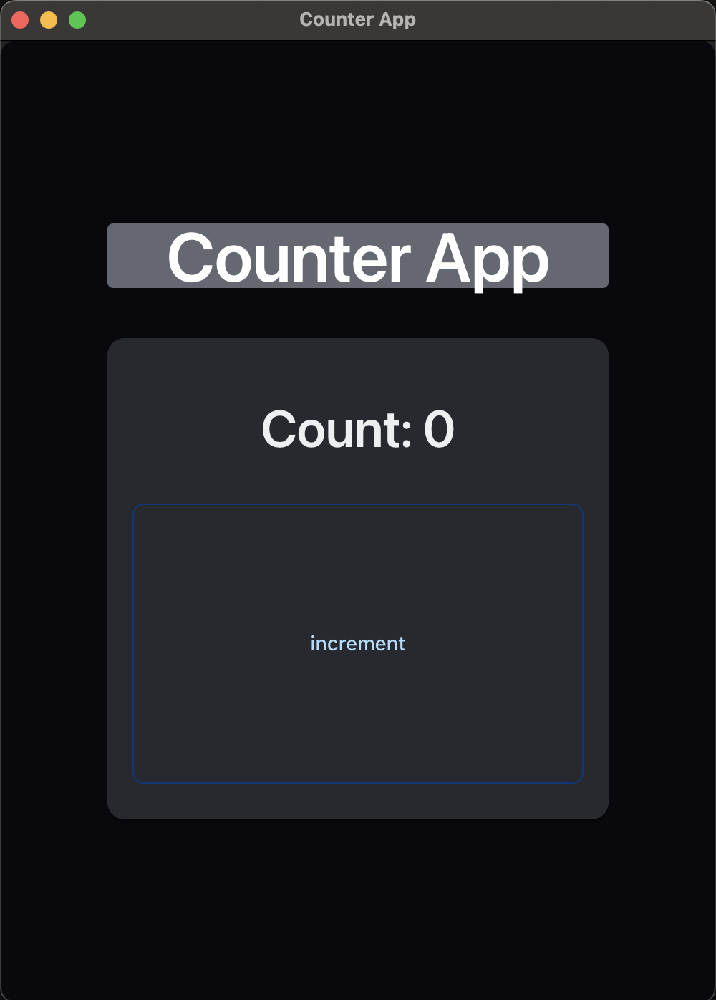

# Freeact - the extremely easy web framework/library
write and serve reactive web applications from the server side using react on nodejs.  

* ### zero config
* ### zero css/html/dom understating needed
* ### based on React
* ### pure nodejs typescript library
* ### transparent server to client communication you wont need to even think about
* ### create web/gui apps with just as easily as you would create node cli apps
* ### great for - python ML applications | dev tools | dashboards | POCs


# Quick Example
the following application is created by only a single code typescript
```tsx
// index.tsx
import React, { useState } from "@freeact/joy/react";
import { Box, Typography, Button } from "@freeact/joy/ui";

function App() {
  const [count, setCount] = useState(0);
  return (
    <Box rows={["45px", "50%"]} columns="70%" gap={35}>
      <Typography variant="solid" type="h1">
        Counter App
      </Typography>
      <Box
        variant="soft"
        columns={"100%"}
        rows={["25%", "65%"]}
        gap={"5%"}
        padding={"5%"}
      >
        <Typography type="h2">Count: {count}</Typography>
        <Button
          onClick={() => setCount(count + 1)}
          variant="outlined"
          color="primary"
          label="increment"
        />
      </Box>
    </Box>
  );
}

// will serve the app to port 8080 and open it using local chrome install
React.serve(() => <App />, {
  runFrom: "chrome-app",
  connection: {
    port: 8080
  }
});

```
now the only thing needed in order to run the application is to install freeact using your preferred package manager

>for example `npm i freeact tsx # or ts-node`  

and run it with
> `npm exec tsx ./index.tsx`

or alternatively you can define it in a `package.json`
```json
// package.json
{
    "scripts": {
      "start": "freeact ./index.tsx"
    },
    "dependencies": {
      "freeact": "latest",
      "tsx": "latest"
    }
  }
  
```
## and we are done,  here is our app 🎉
